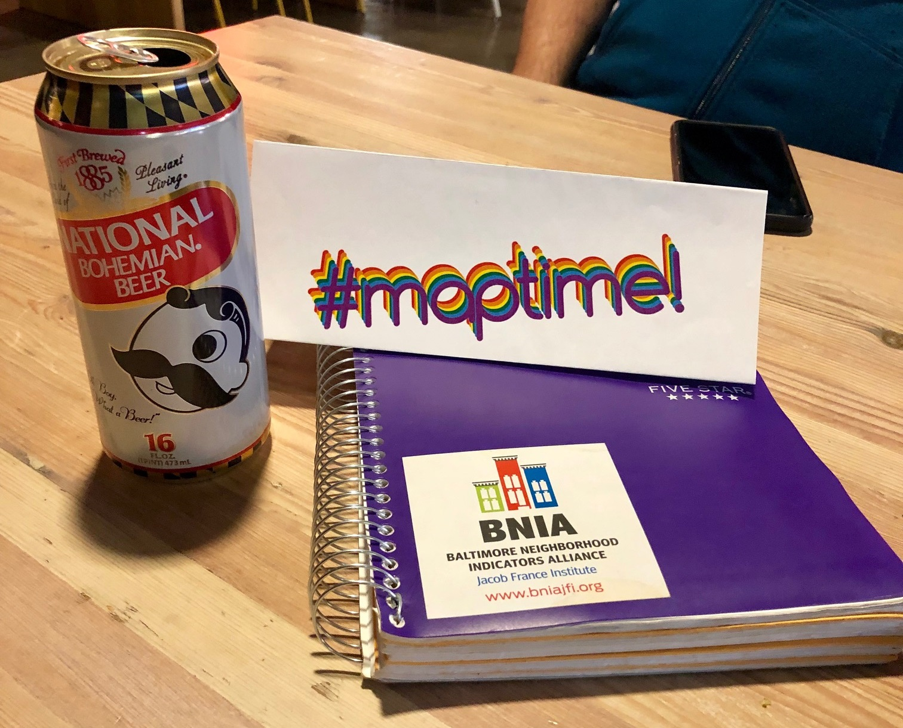

## MaptimeBmore Meetup
Wednesday December 12, 2018 - 630 - 830pm 
R.House, Remington, Baltimore MD 
[39.321832, -76.622120](https://www.openstreetmap.org/search?query=301%20W%2029th%20St%2C%20Baltimore%2C%20MD%2021211%2C%20USA#map=19/39.32167/-76.62214)

Happy hour meetup at RHouse.

## Project ideas
- Digitizing old streetcar / rail line maps into new feature layers for web maps.  It would be great if we can find a group to provide some hosted ArcGIS web services for us to post the streetcar / rail map images as well as new feature service for digitizing rail lines.

## Other information
- MSGIC
  - MSGIC members would like to advertise about MaptimeBmore among their members - we thought that was a great idea.
  - The MSGIC quarterly meeting will be held January 16th 9am - 4pm in Easton MD.
- One user mentioned the [Transportation 101](https://www.cmtalliance.org/transportation-101/) program as a resource for learning about transport in the area

## Next meeting ideas
- Get in touch with Dan Bailey at UMBC for a presentation about historical mapping in Maryland... and possibly an activity for MaptimeBmore to help out with.
- Talking to [TUgis](https://tugisconference.com/) organizers about a MaptimeBmore event / session / content at the next TUgis event in 2019.
- Field trips!
  - Trip to map library or map archive (National Archives, Library of Congress, JHU, UMBC)
  - Mapping field trips for collecting features

