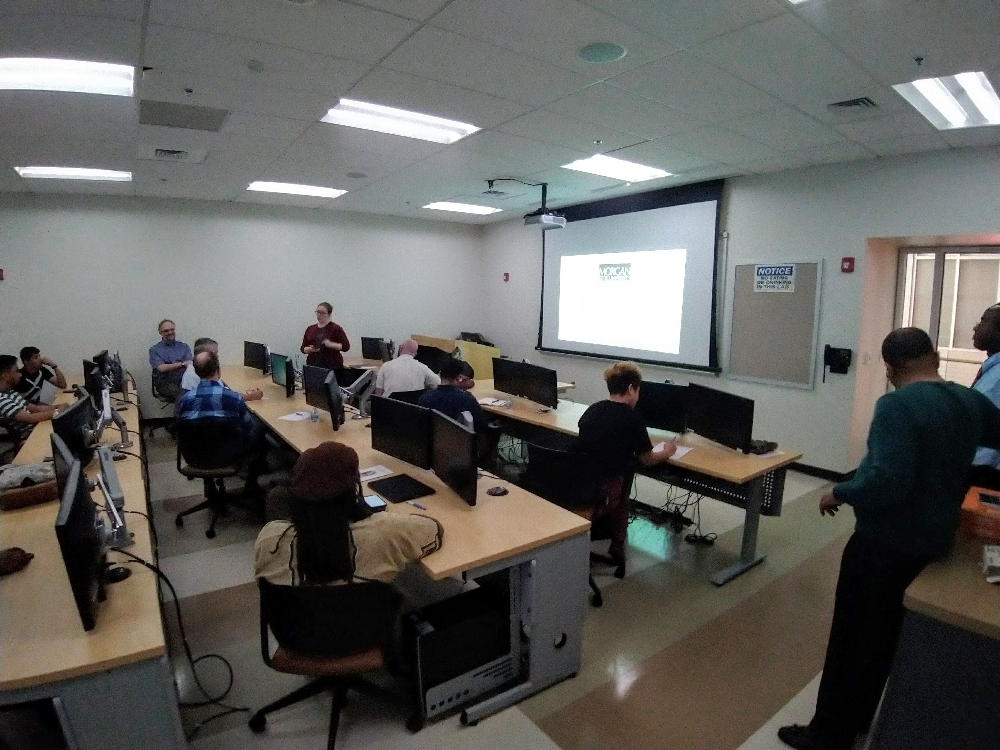

## MaptimeBmore Meetup
Tuesday April 9, 2019 - 630 - 830pm 
Morgan State University, Remington, Baltimore MD 
[39.351335, -76.579982](https://www.openstreetmap.org/#map=19/39.35126/-76.57995)

GIS Jam Morgan Center for Advanced Transportation and Infrastructure Engineering

## Presentations
- [Brian Fuller](https://library.morgan.edu/prf.php?account_id=157316), librarian at Morgan, presented his work on "Geocoding Historical Census Micro-data: Challenges and Opportunities from Pittsburgh, 1880"
- [Justin Fair](https://twitter.com/Soulstrong) presented his work on restoration of the [Mt. Auburn Cemetery](https://www.openstreetmap.org/#map=18/39.25982/-76.63926) in southwest Baltimore.
- [Jonathan Dandois](https://twitter.com/jondandois) showed some highlights about the [SBA HUBZone Map](https://maps.certify.sba.gov/hubzone/map)
- Cheryl Knott presented about Baltimore data at [BNIA](https://bniajfi.org/) and about cultural mapping with [Geoloom](https://geoloom.org/)
- [Karina Mandell](https://twitter.com/KarinaMandell) presented on the [Sync the City](https://sync-the-city.shinyapps.io/sync_map/) project created in R with ShinyMaps
- Our hosts at CATIER, Profs Simon Oladele and Prof Glenn Robinson, presented on upcoming [2019 African-American International Conference on Transportation](https://morgan.edu/ce/icta) happening at Morgan October 29-31, 2019

## References and Resources
- Everyone is encouraged to attend the 2019 TUgis event https://tugisconference.com/
- [MSGIC](http://msgic.org/?) is a great resource for GIS professionals in Maryland
- [Baltimore Data Day](https://bniajfi.org/data_day/) is a great event focused on all things data in Baltimore, stay tuned for info about 2019's Data Day

## Project Ideas
We've had some good chats about possible project ideas, some include:
- Hack session around building a free open-source GIS mapping stack with AWS/PostGIS/NodeJS/Express/Leaflet/QGIS.
- OpenStreetMap hackathon around mapping areas in need in Baltimore, timed with Baltimore Data Day.

Let us know if you have any other ideas!

https://twitter.com/MaptimeBmore
 | https://www.meetup.com/maptime_bmore/

